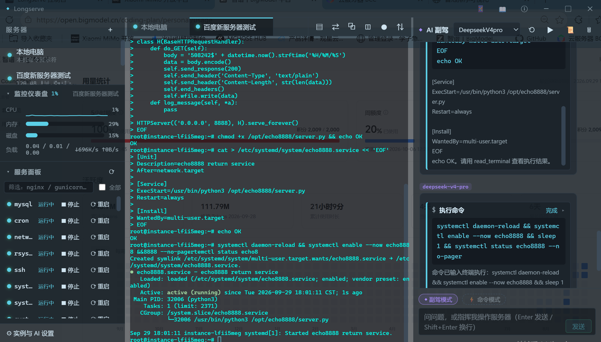

<div align="center">


# Longserve

### 别人的 AI 在聊天，你的 AI 在干活

**把服务器装进桌面，把运维交给 AI——一句话部署上线，双端随身掌控**

[](LICENSE)
[](https://github.com/laolong7/longserve/releases)
[](https://github.com/laolong7/longserve/releases)

[⬇️ 下载](https://github.com/laolong7/longserve/releases) · [💥 为什么是它](#-为什么是-longserve) · [🗺 功能全景](#-功能全景) · [🚀 快速开始](#-快速开始)

<br />



<sub>▲ 真实工作现场：一句话 → AI 生成服务 → 写入 systemd → 启动运行。终端、服务面板、AI 副驾，三栏同屏</sub>

</div>

---

## 😮‍💨 你受够了吗

- 部署个服务：查文档 → 抄命令 → 改配置 → 配 systemd → 搜报错，**一小时没了**
- 五六个 SSH 窗口平铺，每个都敲着一样的 `systemctl status`
- 出了门想看眼日志？——**干瞪眼**
- 让 AI 帮忙？它只会往聊天框里吐命令，**复制、粘贴、执行，还是你自己干**

**Longserve 把这一切压缩成一句话。**

## 💥 为什么是 Longserve

| 场景 | 传统方式 | Longserve |
|------|----------|-----------|
| **部署一个服务** | 查文档、写脚本、配 systemd，半小时起步 | 说一句话，AI 代打全程，**秒级落地** |
| **看服务器状态** | SSH 上去敲一堆命令 | 左侧仪表盘，CPU/内存/磁盘/负载**抬眼就见** |
| **管一堆服务** | 逐个 systemctl | 面板点按启停，状态原位刷新 |
| **出门在外** | 干瞪眼 | 手机扫码，服务/指令/日志**随身掌控** |
| **本地文件** | 另开终端 | 同一个副驾，**顺手打理本机** |
| **AI 能力** | 聊天框里吐字 | 直接动手——**执行、部署、改文件，干完汇报** |

> 不是"AI 辅助你运维"，是 **AI 替你运维**，你负责说人话。

## 🤖 AI 副驾，有手的那种

- **一句话运维** —— 描述需求，AI 生成命令、直接执行、回报结果。部署上线、日常维护，动口不动手
- **终端就在它手边** —— 看得懂当前连接哪个服务器、站在哪个目录，输出流实时可见，跑偏了随时 ^C
- **全协议通吃** —— DeepSeek / OpenAI 兼容 / Anthropic 网关随便接，思考模式链路完整回传，高级参数随手调
- **本地远程通吃** —— 管服务器是它，打理你本机文件也是它

## 📱 双端联动，服务器装进口袋

部署一个轻量 Agent，手机浏览器扫码即绑：

- 服务面板随身带——启停重启，指尖操作
- 远程指令实时输出流，^C 一键中止
- 运行日志随手翻
- AI 对话同样随身——躺床上也能让副驾干活

## 🗺 功能全景

| 分类 | 能力 |
|------|------|
| **连接** | SSH 多服务器管理 · 本地电脑终端 · 状态灯与监控仪表盘 |
| **终端** | xterm 终端 · 逐字符回显 · 缓冲回放 |
| **指令** | 实时输出流 · ^C 一键中止 · 交互命令即时报错 |
| **文件** | SFTP 传输 · 备份管理 · 本地/远程双向 |
| **网络** | 端口转发规则 · 转发列表管理 |
| **服务** | 进程面板启停 · 原位状态刷新 |
| **AI** | 多协议 · 思考模式回传 · 高级参数 · 直接操控文件 |
| **Agent** | 一键部署/更新 · 同端口自愈 · 扫码绑定手机 |

## 🚀 快速开始

1. **下载** —— [Releases](https://github.com/laolong7/longserve/releases) 取安装包或便携版，双击运行
2. **连服务器** —— 左侧添加 SSH 连接，或直接用「本地电脑」终端
3. **部署 Agent**（可选）—— 一键部署，解锁手机扫码控制
4. **配 AI**（可选）—— 填任意一家 API Key，副驾就位

然后，对着它说人话就行。

## 🛠 开发

```bash
npm install       # 安装依赖
npm run dev       # 开发模式
npm run dist      # 打包 exe（产出在 release/）
```

## 💡 常见问题

<details>
<summary>本地终端打不出 vim / top？</summary>

本地终端是管道模式（cmd 级），适合日常命令；vim、top 这类全屏交互程序请走 SSH 终端。
</details>

<details>
<summary>mysql 为什么提示输入不了密码？</summary>

指令通道不支持交互输入（`mysql -u root -p` 会停在密码提示）。把参数带全一条跑完：

```bash
mysql -u root -p'密码' -e 'show databases;'
```

注意 `-p` 和密码之间**没有空格**。
</details>

<details>
<summary>手机端怎么用？</summary>

在服务器上部署 Agent 后，手机浏览器扫码绑定——服务、指令、日志、AI 对话全在掌上。
</details>

## 📄 协议

[MIT](LICENSE) 协议开源 · Issues 欢迎反馈

<div align="center">

**Longserve** · 运维的尽头，是一句话

</div>
